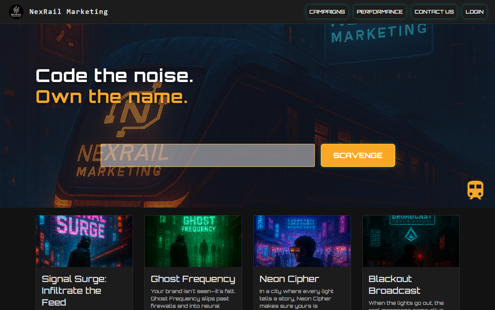
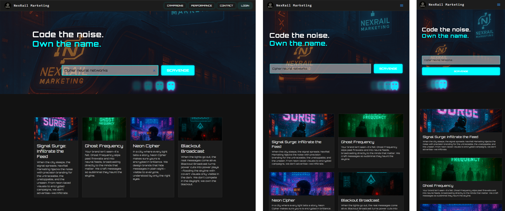

<!-- Improved compatibility of back to top link: See: https://github.com/othneildrew/Best-README-Template/pull/73 -->

<a id="readme-top"></a>

<!--
*** Thanks for checking out the Best-README-Template. If you have a suggestion
*** that would make this better, please fork the repo and create a pull request
*** or simply open an issue with the tag "enhancement".
*** Don't forget to give the project a star!
*** Thanks again! Now go create something AMAZING! :D
-->

<!-- PROJECT SHIELDS -->
<!--
*** I'm using markdown "reference style" links for readability.
*** Reference links are enclosed in brackets [ ] instead of parentheses ( ).
*** See the bottom of this document for the declaration of the reference variables
*** for contributors-url, forks-url, etc. This is an optional, concise syntax you may use.
*** https://www.markdownguide.org/basic-syntax/#reference-style-links
-->

[![Contributors][contributors-shield]][contributors-url]
[![Forks][forks-shield]][forks-url]
[![Stargazers][stars-shield]][stars-url]
[![Issues][issues-shield]][issues-url]
[![GNU General Public License v3.0][license-shield]][license-url]
[![LinkedIn][linkedin-shield]][linkedin-url]

<!-- PROJECT LOGO -->
<br />
<div align="center">
  <a href="https://github.com/tonkatommy/MRHQ-L5-Mission-0">
    
  </a>

<h3 align="center">Mission 0</h3>

  <p align="center">
    Create the page according to the wireframe in the Project Brief.<br />
    Required to be responsive on mobile screens.
    <br />
    <br />
    <a href="https://github.com/tonkatommy/MRHQ-L5-Mission-0"><strong>Explore the docs »</strong></a>
    <br />
    <br />
    <a href="https://github.com/tonkatommy/MRHQ-L5-Mission-0">View Demo</a>
    &middot;
    <a href="https://github.com/tonkatommy/MRHQ-L5-Mission-0/issues/new?labels=bug&template=bug-report---.md">Report Bug</a>
    &middot;
    <a href="https://github.com/tonkatommy/MRHQ-L5-Mission-0/issues/new?labels=enhancement&template=feature-request---.md">Request Feature</a>
  </p>
</div>

<!-- TABLE OF CONTENTS -->
<details>
  <summary>Table of Contents</summary>
  <ol>
    <li>
      <a href="#about-the-project">About The Project</a>
      <ul>
        <li><a href="#built-with">Built With</a></li>
      </ul>
    </li>
    <li>
      <a href="#getting-started">Getting Started</a>
      <ul>
        <li><a href="#prerequisites">Prerequisites</a></li>
        <li><a href="#installation">Installation</a></li>
      </ul>
    </li>
    <li><a href="#usage">Usage</a></li>
    <li><a href="#roadmap">Roadmap</a></li>
    <li><a href="#contributing">Contributing</a></li>
    <li><a href="#license">License</a></li>
    <li><a href="#contact">Contact</a></li>
    <li><a href="#acknowledgments">Acknowledgments</a></li>
  </ol>
</details>

<!-- ABOUT THE PROJECT -->

## About The Project

<!-- [![Product Name Screen Shot][product-screenshot]](https://example.com) -->



This is the first Mission (Mission 0) for the Full stack developers Diploma advanced section.  
The instructions I followed are:

**"Create the page according to the wireframe in the Project Brief. Remember to make it responsive on mobile screens."**

I have produced a webpage using Node and React. I've used my own images and colour theme. Using the project brief wireframe I have come up with this solution. Making the site responsive is a requirement and I have achieved full responsivness using media queries and MUI `sx={}` property.

Enjoyment from building this project is something I greatly appreciate. It was fun to use MUI components for almost everything I could. Styling MUI components can be somewhat daunting but I perservered and successfully completed a working version.

<p align="right">(<a href="#readme-top">back to top</a>)</p>

### Built With

<!-- - [![Next][Next.js]][Next-url] -->

- [![React][React.js]][React-url]
  <!-- - [![Vue][Vue.js]][Vue-url] -->
  <!-- - [![Angular][Angular.io]][Angular-url] -->
  <!-- - [![Svelte][Svelte.dev]][Svelte-url] -->
  <!-- - [![Laravel][Laravel.com]][Laravel-url] -->
  <!-- - [![Bootstrap][Bootstrap.com]][Bootstrap-url] -->
  <!-- - [![JQuery][JQuery.com]][JQuery-url] -->

<p align="right">(<a href="#readme-top">back to top</a>)</p>

<!-- GETTING STARTED -->

## Getting Started

This is an example of how you may give instructions on setting up your project locally.
To get a local copy up and running follow these simple example steps.

### Installation

1. Clone the repo
   ```sh
   git clone https://github.com/tonkatommy/MRHQ-L5-Mission-0.git
   ```
2. Install NPM packages
   ```sh
   npm i
   ```
3. Change git remote url to avoid accidental pushes to base project
   ```sh
   git remote set-url origin [link/to/your/repo.git]
   git remote -v # confirm the changes
   ```
4. Run the app
   ```sh
   npm run dev
   ```

<p align="right">(<a href="#readme-top">back to top</a>)</p>

<!-- USAGE EXAMPLES -->

## Usage

Here we have our site working at different screen sizes:



As you can see the site responds nicely to the different screen sizes. I had alot of enjoyment figuring out how achieve the responsivness. Learning there are different ways to achieve the same effect was exciting.

<p align="right">(<a href="#readme-top">back to top</a>)</p>

<!-- CONTRIBUTING -->

## Contributing

Contributions are what make the open source community such an amazing place to learn, inspire, and create. Any contributions you make are **greatly appreciated**.

If you have a suggestion that would make this better, please fork the repo and create a pull request. You can also simply open an issue with the tag "enhancement".
Don't forget to give the project a star!⭐ Thanks again!

1. Fork the Project
2. Create your Feature Branch (`git checkout -b feature/RadicalFeature`)
3. Commit your Changes (`git commit -m 'Add some Radical Feature I just thought of.'`)
4. Push to the Branch (`git push origin feature/RadicalFeature`)
5. Open a Pull Request

<p align="right">(<a href="#readme-top">back to top</a>)</p>

### Top contributors:

<a href="https://github.com/tonkatommy/MRHQ-L5-Mission-0/graphs/contributors">
  
</a>

<!-- LICENSE -->

## License

Distributed under the GPL-3.0 license. See [LICENSE.txt](https://github.com/tonkatommy/MRHQ-L5-Mission-0/blob/main/LICENSE.txt) for more information.

<p align="right">(<a href="#readme-top">back to top</a>)</p>

<!-- CONTACT -->

## Contact

Tommy Goodman - [@tonkatommy](https://github.com/tonkatommy) - thomasgo@missionreadyhq.com

Project Link: [https://github.com/tonkatommy/MRHQ-L5-Mission-0](https://github.com/tonkatommy/MRHQ-L5-Mission-0)

<p align="right">(<a href="#readme-top">back to top</a>)</p>

<!-- ACKNOWLEDGMENTS -->

## Acknowledgments

- [Hazel, she's the goodest girl 🐕](https://scontent.fpmr1-1.fna.fbcdn.net/v/t39.30808-6/518380841_10165687428601754_4865577828235872821_n.jpg?_nc_cat=108&ccb=1-7&_nc_sid=a5f93a&_nc_ohc=Q4sc8rW8n7UQ7kNvwE3SsfS&_nc_oc=AdndYrVBQA5xoZMTiosZghg9MCU1ZnI11NcfFGRN7O7PN0sE6xWW5v6ikKa06_UQc5Q&_nc_zt=23&_nc_ht=scontent.fpmr1-1.fna&_nc_gid=u8E8ajfhU6qHDlRrQ0oLYg&oh=00_AfVbqSY9J7uwPyMgDjzxUpaTW3ZZQ49Fq4n8T3QbUkAoCA&oe=689941D6)

<p align="right">(<a href="#readme-top">back to top</a>)</p>

<!-- MARKDOWN LINKS & IMAGES -->
<!-- https://www.markdownguide.org/basic-syntax/#reference-style-links -->

[contributors-shield]: https://img.shields.io/github/contributors/tonkatommy/MRHQ-L5-Mission-0.svg?style=for-the-badge
[contributors-url]: https://github.com/tonkatommy/MRHQ-L5-Mission-0/graphs/contributors
[forks-shield]: https://img.shields.io/github/forks/tonkatommy/MRHQ-L5-Mission-0.svg?style=for-the-badge
[forks-url]: https://github.com/tonkatommy/MRHQ-L5-Mission-0/network/members
[stars-shield]: https://img.shields.io/github/stars/tonkatommy/MRHQ-L5-Mission-0.svg?style=for-the-badge
[stars-url]: https://github.com/tonkatommy/MRHQ-L5-Mission-0/stargazers
[issues-shield]: https://img.shields.io/github/issues/tonkatommy/MRHQ-L5-Mission-0.svg?style=for-the-badge
[issues-url]: https://github.com/tonkatommy/MRHQ-L5-Mission-0/issues
[license-shield]: https://img.shields.io/github/license/tonkatommy/MRHQ-L5-Mission-0.svg?style=for-the-badge
[license-url]: https://github.com/tonkatommy/MRHQ-L5-Mission-0/blob/main/LICENSE.txt
[linkedin-shield]: https://img.shields.io/badge/-LinkedIn-black.svg?style=for-the-badge&logo=linkedin&colorB=555
[linkedin-url]: https://linkedin.com/in/tgnz
[product-screenshot]: images/screenshot.png
[Next.js]: https://img.shields.io/badge/next.js-000000?style=for-the-badge&logo=nextdotjs&logoColor=white
[Next-url]: https://nextjs.org/
[React.js]: https://img.shields.io/badge/React-20232A?style=for-the-badge&logo=react&logoColor=61DAFB
[React-url]: https://reactjs.org/
[Vue.js]: https://img.shields.io/badge/Vue.js-35495E?style=for-the-badge&logo=vuedotjs&logoColor=4FC08D
[Vue-url]: https://vuejs.org/
[Angular.io]: https://img.shields.io/badge/Angular-DD0031?style=for-the-badge&logo=angular&logoColor=white
[Angular-url]: https://angular.io/
[Svelte.dev]: https://img.shields.io/badge/Svelte-4A4A55?style=for-the-badge&logo=svelte&logoColor=FF3E00
[Svelte-url]: https://svelte.dev/
[Laravel.com]: https://img.shields.io/badge/Laravel-FF2D20?style=for-the-badge&logo=laravel&logoColor=white
[Laravel-url]: https://laravel.com
[Bootstrap.com]: https://img.shields.io/badge/Bootstrap-563D7C?style=for-the-badge&logo=bootstrap&logoColor=white
[Bootstrap-url]: https://getbootstrap.com
[JQuery.com]: https://img.shields.io/badge/jQuery-0769AD?style=for-the-badge&logo=jquery&logoColor=white
[JQuery-url]: https://jquery.com
